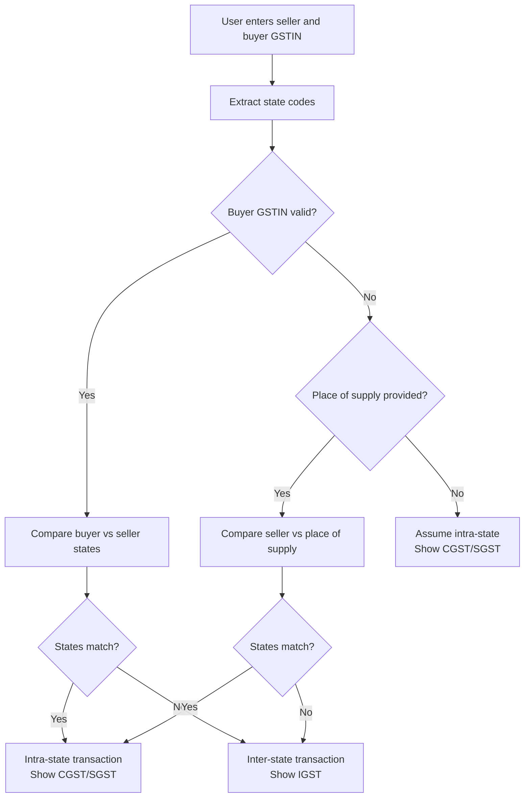

# GST Form Logic Documentation

This document explains the complete flow and logic for how GST tax fields work in the invoice generation tool, specifically when IGST is shown versus when CGST/SGST fields are displayed.

## Overview

The system automatically determines whether to show IGST (Integrated GST) or CGST/SGST (Central GST + State GST) fields based on the seller and buyer GSTIN numbers. This follows the Indian GST rules:

- **Intra-state transactions** (same state): Use CGST + SGST
- **Inter-state transactions** (different states): Use IGST

## Decision Logic Flow



## Detailed Implementation

### 1. State Code Extraction

The system extracts the first 2 digits from GSTIN numbers to determine state codes:

```typescript
function getStateCodeFromGSTIN(gstin: string): string | null {
  if (!gstin || gstin.length < 2) return null
  return gstin.substring(0, 2)
}
```

### 2. Inter-state vs Intra-state Determination

The determination logic in `TaxDetails` component:

```typescript
const sellerState = getStateCodeFromGSTIN(formData.sellerGSTIN)
const buyerState = getStateCodeFromGSTIN(formData.buyerGSTIN)
const isInterState = buyerState 
  ? sellerState !== buyerState 
  : formData.placeOfSupplyState 
    ? sellerState !== formData.placeOfSupplyState
    : false // Default to intra-state when both buyer GSTIN and place of supply are missing
```

Special cases:
- If buyer GSTIN is missing but placeOfSupplyState is provided, compares seller state with place of supply state
- If both buyer GSTIN and placeOfSupplyState are missing, assumes intra-state transaction
- If either GSTIN is invalid/missing, defaults to intra-state

### 3. Field Display Logic

Based on the `isInterState` flag:

#### Inter-state Transaction (Show IGST):
- Single IGST field displayed
- CGST and SGST fields hidden
- IGST rate = total GST rate

#### Intra-state Transaction (Show CGST/SGST):
- Two fields displayed: CGST and SGST
- IGST field hidden
- CGST = SGST = total GST rate ÷ 2

### 4. Quick Select Preset Behavior

When user clicks a GST rate preset:

```typescript
const handlePresetClick = (rate: number) => {
  if (isInterState) {
    // For inter-state: set IGST to full rate
    setFormData((prev) => ({ ...prev, igst: rate.toString(), cgst: "0", sgst: "0" }))
  } else {
    // For intra-state: split rate equally between CGST and SGST
    const half = (rate / 2).toString()
    setFormData((prev) => ({ ...prev, cgst: half, sgst: half, igst: "0" }))
  }
}
```

### 5. Dynamic Field Switching

The system automatically converts between IGST and CGST/SGST when the transaction type changes:

```typescript
useEffect(() => {
  if (!setFormData) return

  if (isInterState) {
    // Converting to inter-state: combine CGST+SGST into IGST
    const currentTotal = (Number.parseFloat(formData.cgst) || 0) + 
                         (Number.parseFloat(formData.sgst) || 0)
    if (currentTotal > 0) {
      setFormData((prev) => ({ ...prev, igst: currentTotal.toString(), cgst: "0", sgst: "0" }))
    }
  } else {
    // Converting to intra-state: split IGST into CGST/SGST
    const currentIGST = Number.parseFloat(formData.igst || "0") || 0
    if (currentIGST > 0) {
      const half = (currentIGST / 2).toString()
      setFormData((prev) => ({ ...prev, cgst: half, sgst: half, igst: "0" }))
    }
  }
}, [isInterState, setFormData])
```

## Validation Rules

### Field-Level Validation:
- **CGST**: 0-14% (decimal numbers allowed)
- **SGST**: 0-14% (decimal numbers allowed)
- **IGST**: 0-28% (decimal numbers allowed)

### Cross-Field Validation:
1. Cannot have IGST > 0 AND (CGST > 0 OR SGST > 0)
2. Valid GST slabs supported: 0%, 5%, 12%, 18%, 28% (Automatically split into CGST/SGST where applicable)
3. For intra-state: CGST must equal SGST
4. For inter-state: Only IGST should be present

## Calculation Logic

### In Invoice Calculator (`invoice-calculator.ts`):

```typescript
if (isInterState && formData.igst) {
  // Inter-state: Apply IGST to subtotal
  const igst = Number.parseFloat(formData.igst) || 0
  const igstPaise = Math.round((subtotalPaise * igst) / 100)
  igstAmount = igstPaise / 100
} else {
  // Intra-state: Apply CGST and SGST to subtotal
  const cgst = Number.parseFloat(formData.cgst) || 0
  const sgst = Number.parseFloat(formData.sgst) || 0
  const cgstPaise = Math.round((subtotalPaise * cgst) / 100)
  const sgstPaise = Math.round((subtotalPaise * sgst) / 100)
  cgstAmount = cgstPaise / 100
  sgstAmount = sgstPaise / 100
}
```

## PDF Generation

The PDF generator follows the same logic to display either IGST or CGST/SGST fields based on the `isInterState` flag:

```typescript
if (totals.isInterState) {
  // Render IGST line
  doc.text(`IGST (${data.igst}%):`, 140, y)
  doc.text(money(totals.igstAmount), 185, y, { align: "right" })
} else {
  // Render CGST and SGST lines
  doc.text(`CGST (${data.cgst}%):`, 140, y)
  doc.text(money(totals.cgstAmount), 185, y, { align: "right" })
  y += 6
  doc.text(`SGST (${data.sgst}%):`, 140, y)
  doc.text(money(totals.sgstAmount), 185, y, { align: "right" })
}
```

## Testing Scenarios

### Scenario 1: Same State Transaction
- Seller GSTIN: 29AAAAA0000A1Z1 (Karnataka - 29)
- Buyer GSTIN: 29BBBBB0000B1Z2 (Karnataka - 29)
- Result: Shows CGST/SGST fields

### Scenario 2: Different State Transaction
- Seller GSTIN: 29AAAAA0000A1Z1 (Karnataka - 29)
- Buyer GSTIN: 06CCCCCC0000C1Z3 (Haryana - 06)
- Result: Shows IGST field

### Scenario 3: Missing Buyer GSTIN (without place of supply)
- Seller GSTIN: 29AAAAA0000A1Z1 (Karnataka - 29)
- Buyer GSTIN: (empty)
- Place of Supply State: (empty)
- Result: Shows CGST/SGST fields (assumes intra-state)

### Scenario 3b: Missing Buyer GSTIN (with place of supply - inter-state)
- Seller GSTIN: 29AAAAA0000A1Z1 (Karnataka - 29)
- Buyer GSTIN: (empty)
- Place of Supply State: 06 (Haryana)
- Result: Shows IGST fields (inter-state transaction)

### Scenario 3c: Missing Buyer GSTIN (with place of supply - intra-state)
- Seller GSTIN: 29AAAAA0000A1Z1 (Karnataka - 29)
- Buyer GSTIN: (empty)
- Place of Supply State: 29 (Karnataka)
- Result: Shows CGST/SGST fields (intra-state transaction)

### Scenario 4: Changing Transaction Type
1. Start with Karnataka seller (29) and Tamil Nadu buyer (33) → IGST shown
2. Change buyer to Karnataka (29) → System automatically converts to CGST/SGST

### Scenario 5: Preset Selection
- Select 18% GST rate
- For intra-state: Sets CGST=9% and SGST=9%
- For inter-state: Sets IGST=18%

## Key Implementation Notes

1. **All tax fields are read-only** - Users must use the quick select buttons to set rates
2. **Automatic conversion** occurs when switching between inter-state and intra-state
3. **Validation prevents invalid combinations** (e.g., having both IGST and CGST/SGST)
4. **Only standard GST rates are allowed** (0%, 5%, 12%, 18%, 28%)
5. **Equal splitting** for CGST/SGST ensures compliance with GST rules
6. **Place of supply handling** - When buyer GSTIN is missing, place of supply state is used to determine transaction type
7. **Invalid seller GSTIN handling** - If seller GSTIN is invalid, the system defaults to intra-state transaction

This logic ensures that the correct tax fields are displayed and calculated according to Indian GST regulations while providing a smooth user experience.